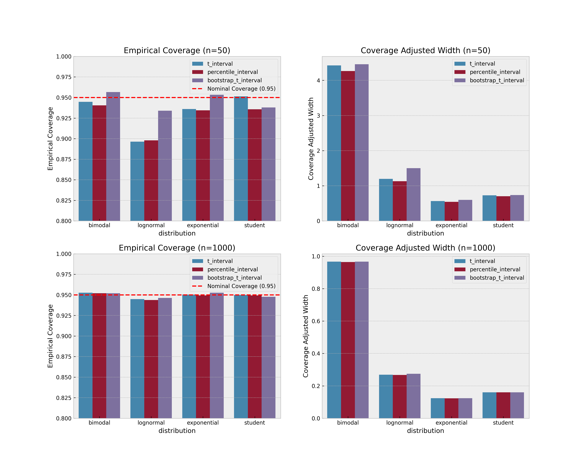

# Description of the project

This is a short study on different methods of constructing confidence intervals.

All the details can be found in the `study.ipynb` file.

# Result

In the case of a small sample size, all intervals suffer if the underlying distribution is highly skewed. However, the `bootstrap t interval` performs slightly better than the `t` and `percentile` intervals.
For a large sample size, there are subtle differences between the methods. Note that all intervals still fail to achieve the required level of coverage for the lognormal distribution.

